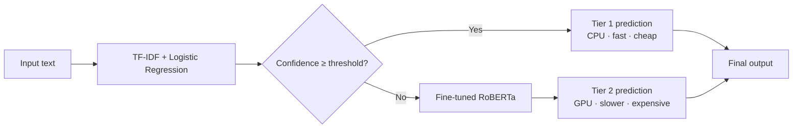
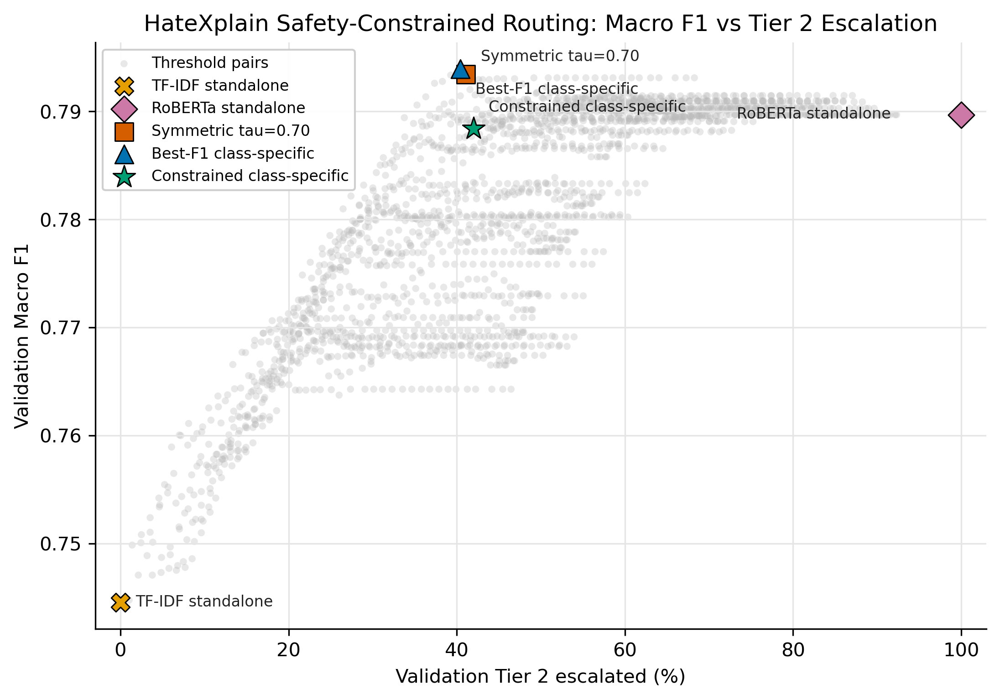
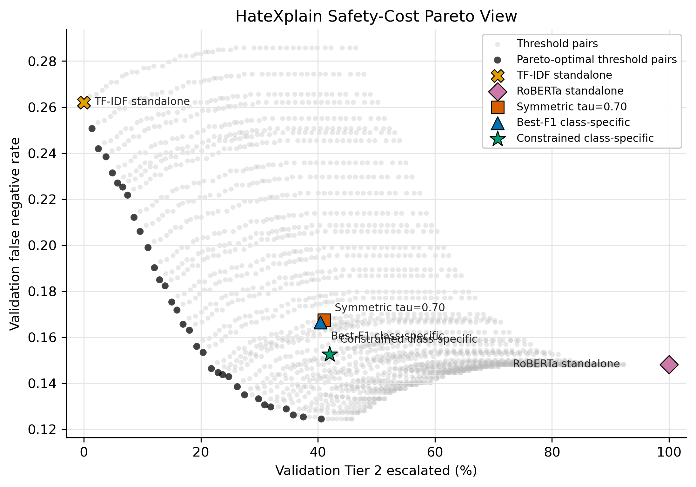
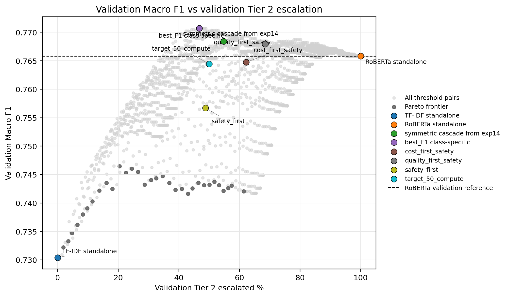

# Cost-Aware Cascaded NLP for Linguistic Threat Detection

A compact NLP/ML engineering project comparing TF-IDF, RoBERTa, and cost-aware cascade routing for hate-speech / linguistic-threat detection.


---

## What This Project Shows

- **Classical ML baseline** — TF-IDF (word + character n-grams) with Logistic Regression as a fast CPU-only first tier
- **Transformer-based NLP** — fine-tuned `roberta-base` as the stronger second tier
- **Confidence/safety-aware routing** — class-specific thresholds route high-confidence examples to the cheap model and escalate uncertain ones to the transformer
- **Rigorous evaluation** — Macro F1, per-class recall, false-negative rate (FNR), and routing percentage tracked together
- **API-free reproducible release** — all public checks run locally with no external service keys

---

## Key Result

The safety-constrained cascade routes **38–60% of examples to the cheap CPU classifier** while also **reducing the false-negative rate** compared to running the transformer on every example — on both datasets.

| Dataset | System | Macro F1 | FNR | Tier 1 % | RoBERTa % |
|---|---|---|---|---|---|
| HateXplain | TF-IDF standalone | 0.7739 | 0.2224 | 100% | 0% |
| HateXplain | RoBERTa standalone | 0.7911 | 0.1594 | 0% | 100% |
| HateXplain | Best-F1 cascade | 0.7942 | 0.1734 | 63% | 37% |
| **HateXplain** | **Safety-constrained cascade** | **0.7913** | **0.1497** | **60%** | **40%** |
| OLID | TF-IDF standalone | 0.7282 | 0.3583 | 100% | 0% |
| OLID | RoBERTa standalone | 0.8105 | 0.2208 | 0% | 100% |
| OLID | Best-F1 cascade | 0.8090 | 0.2667 | 52% | 48% |
| **OLID** | **Safety-constrained cascade** | **0.8059** | **0.2083** | **38%** | **62%** |

Full tables: [`results/summary_tables.md`](results/summary_tables.md)

---

## Architecture



Routing thresholds are **class-specific** (`τ_threat`, `τ_safe`) and selected on a validation set under a safety constraint: the cascade must not increase the false-negative rate by more than `ε = 0.01` relative to the RoBERTa standalone baseline.

---

## Result Figures

**HateXplain — Macro F1 vs Tier 2 usage across all threshold pairs**



**HateXplain — FNR vs Tier 2 usage and Pareto frontier**



**OLID — Macro F1 vs Tier 2 usage**



---

## Quickstart

```bash
python -m venv .venv
source .venv/bin/activate       # Windows: .venv\Scripts\activate
pip install -r requirements.txt

python scripts/smoke_test.py    # sanity check — no datasets or API keys needed
python scripts/collect_results.py  # regenerates results/ summaries
pytest -q                       # runs 23 unit + integration tests
```

No Gemini, DeepSeek, OpenAI, or other paid API key is required for any of these commands.

---

## Repository Structure

```
core_thesis/          experiment scripts + saved result JSON/PNG outputs
  outputs/            saved result files and figures (committed)
scripts/              smoke_test.py, collect_results.py
tests/                23 pytest tests (cascade logic, API-free checks, files)
docs/                 architecture, reproducibility, project card
results/              generated summaries (CSV + Markdown)
configs/              reserved for public config files
```

---

## API-Free Public Release

No Gemini, DeepSeek, OpenAI, or external paid API key is required.

External LLM experiments are not part of the public reproducible core. The main workflow reads from existing saved output files — no model retraining or dataset download is needed to run the checks and summaries.

To retrain models from scratch (optional, requires GPU/MPS):

```bash
python core_thesis/exp3_hatexplain_roberta.py   # fine-tune RoBERTa on HateXplain
python core_thesis/exp7b_olid_roberta_clean_subtrain.py  # fine-tune on OLID
```

See [`core_thesis/README.md`](core_thesis/README.md) for a description of all experiment scripts.

---

## Limitations

- Results depend on saved outputs from prior training runs; full reproduction requires GPU/MPS
- Hate-speech dataset labels can be noisy and encode annotation bias
- False negatives are especially important in threat detection; the cascade explicitly tracks FNR as a first-class metric
- Confidence thresholds selected on one dataset domain may not transfer to another
- Raw datasets and model checkpoints are not committed (download from Hugging Face)

---

## Tech Stack

Python · scikit-learn · Hugging Face Transformers · PyTorch · pandas · NumPy · pytest · Git/GitHub

Datasets: [HateXplain](https://huggingface.co/datasets/hatexplain) · [OLID](https://huggingface.co/datasets/christophsonntag/OLID)

---

## License

[MIT License](LICENSE) — dataset and pretrained-model licenses remain governed by their original providers.

<!-- Suggested GitHub topics: machine-learning nlp text-classification hate-speech-detection roberta scikit-learn pytorch transformers ml-engineering model-routing -->
