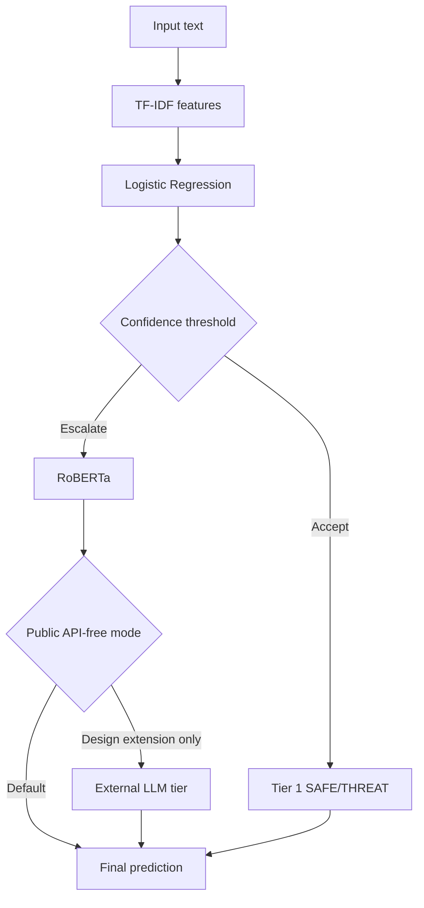

# Architecture

This project implements a cost-aware cascade for binary linguistic threat detection.

## Tier 1: TF-IDF + Logistic Regression

The first tier is a cheap CPU-only text classifier. It is intended for easy, high-confidence examples where a classical model is enough. This tier provides fast inference and avoids unnecessary transformer calls.

## Tier 2: RoBERTa

The second tier is a stronger transformer classifier. The cascade escalates uncertain Tier 1 examples to RoBERTa. This lets the system reserve heavier inference for cases where the cheap classifier is less reliable.

## Tier 3: External LLM Escalation Concept

External LLM escalation is documented as a possible extension, but it is not part of the public runnable core. No public workflow requires paid APIs or API keys.

## Routing

Routing is based on confidence thresholds selected on validation data. The saved outputs report Macro F1, false-negative rate, Tier 1 handled percentage, RoBERTa usage, and related compute/latency measures.

## Local vs API-Dependent Reproducibility

Local reproducibility includes summary generation, smoke tests, and API-free scripts. Transformer retraining is more expensive and may require GPU/MPS/CUDA. External LLM calls are intentionally not part of the public workflow.
